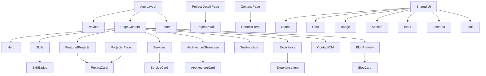

# Component Structure

## Explanation

The root layout wraps every page with `Navbar` and `Footer`. Page content is composed from section components on the home page, or dedicated page components on routes like `/projects` and `/contact`.

Portfolio-specific components (`ProjectCard`, `ServiceCard`, etc.) consume data from `data/` files. Shared UI primitives provide consistent styling and behavior across the site.
