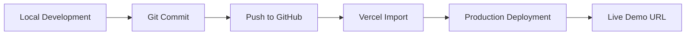

# Deployment

**Live demo:** https://developer-portfolio-eight-alpha.vercel.app/

## Deployment Steps

1. Build locally with `pnpm build`.
2. Push to GitHub repository `Valakasneckle/05-developer-portfolio`.
3. Import the repository into Vercel.
4. Deploy with default Next.js settings (no custom build command required).
5. Copy the production URL.
6. Add the live URL to `README.md` and `.env.example` as `NEXT_PUBLIC_SITE_URL`.
7. Add the live URL to the GitHub repository **About** section (Website field).
8. Add the live URL to LinkedIn profile and any portfolio hub or README index.

## Environment Variables

| Variable | Description |
|----------|-------------|
| `NEXT_PUBLIC_SITE_URL` | Public site URL for metadata and links |

Copy `.env.example` to `.env.local` for local development.

## Vercel Notes

- Framework preset: Next.js
- Node.js 18+
- No additional build configuration required
- Ensure `next-mdx-remote` and other dependencies are up to date if MDX blog is re-enabled later
