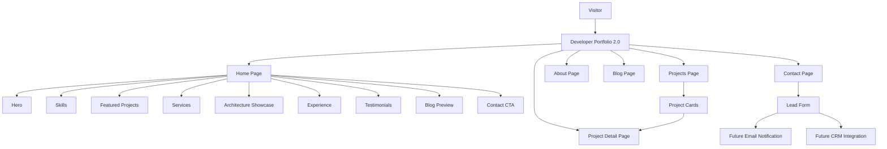

# System Overview

## Explanation

Developer Portfolio 2.0 is a multi-page Next.js application. Visitors typically land on the home page, review skills and featured projects, explore services and architecture thinking, then move to project detail pages or the contact form.

The contact form is currently UI-only. Future integrations can connect it to email services or a CRM for lead management.

Data for all pages is sourced from typed static files in the `data/` directory, keeping content editable without a database or CMS.
