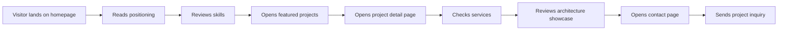

# User Flow

## Explanation

The portfolio conversion flow is designed to build trust progressively:

1. **Positioning** — Hero explains what the developer builds and for whom.
2. **Credibility** — Skills and experience establish technical range.
3. **Proof** — Featured projects and detail pages show real work depth.
4. **Commercial fit** — Services and architecture sections answer "can they handle my project?"
5. **Action** — Contact page captures project type, budget, and message.

Repeated CTAs on the home page (hero, contact CTA) and navbar ("Hire Me") give visitors multiple exit points to start a conversation.
